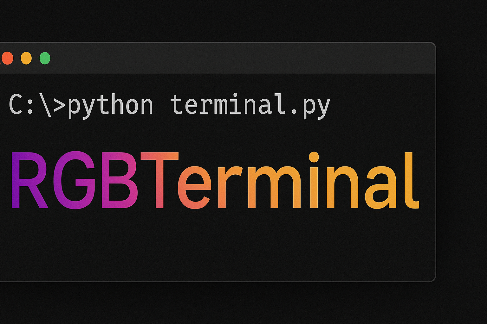

<br>

Terminal text coloring with RGB and multi-stop gradients in Python.

---

## Features

- Color text in the terminal using **24-bit RGB** or **256-color approximation**
- Multi-stop gradient support
- Easy-to-use factories for repetitive usage
- Pure Python, minimal dependencies (`numpy`)

---

## Installation

```bash
pip install rgbterminal
```

---

## Usage

### Basic RGB Text

```python
from rgbterminal import RGBText

text = RGBText("Hello World!", rgb=(255, 0, 0), truecolor=True)
print(text)
```

### RGBTextFactory

```python
from rgbterminal import RGBTextFactory

factory = RGBTextFactory(rgb=(0, 128, 255), truecolor=True)
text1 = factory.t("Hello")
text2 = factory.t("World")
print(text1, text2)
```

---

## Gradient Text

`GradientText` allows you to apply a **smooth gradient** across a string using multiple color stops.

### Multi-stop Gradient Example

```python
from rgbterminal import GradientText

gradient = GradientText(
    "Gradient Example",
    rgb_stops=[(255, 0, 0), (255, 255, 0), (0, 255, 0), (0, 0, 255)],
    truecolor=True
)
print(gradient)
```

- Supports **any number of RGB stops**.
- Interpolates colors in **HLS space** for smooth transitions.
- Works with both **truecolor (24-bit)** and **256-color terminals**.

### GradientTextFactory

```python
from rgbterminal import GradientTextFactory

factory = GradientTextFactory(rgb_stops=[(255,0,0), (0,0,255)], truecolor=True)
text = factory.t("Hello Gradient!")
print(text)
```

- Factory allows you to reuse the same gradient multiple times.
- You can override stops per call if needed.

---

## License

MIT License
